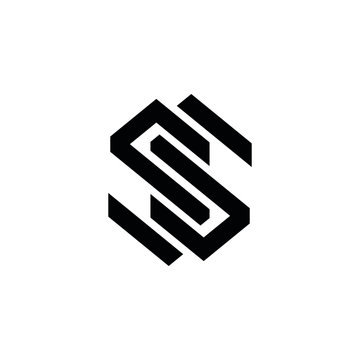

<a name="readme-top">

<br/>

<br />
<div align="center">
  <a href="https://github.com/SaynoSean/">
    
  </a>
<!-- TODO: Change Title to the name of the title of your Project -->
  <h3 align="center">Cinema Reservation</h3>
</div>
<!-- TODO: Make a short description -->
<div align="center">
  A showcase of Cinema Reservation
</div>

<br />

<!-- TODO: Change the zyx-0314 into your github username  -->
<!-- TODO: Change the WD-Template-Project into the same name of your folder -->


[](https://wakatime.com/badge/user/9c7b319f-0a4f-4bf8-b099-f9f3aec27c02/project/b36557b4-0929-4d98-8e55-b2238ca96a51)
---

<br />
<br />

<!-- TODO: If you want to add more layers for your readme -->
<details>
  <summary>Table of Contents</summary>
  <ol>
    <li>
      <a href="#overview">Overview</a>
      <ol>
        <li>
          <a href="#key-components">Key Components</a>
        </li>
        <li>
          <a href="#technology">Technology</a>
        </li>
      </ol>
    </li>
    <li>
      <a href="#rule,-practices-and-principles">Rules, Practices and Principles</a>
    </li>
    <li>
      <a href="#resources">Resources</a>
    </li>
  </ol>
</details>

---

## Overview

<!-- TODO: To be changed -->
<!-- The following are just sample -->
Description of the project in details.

Guiding Question:
- Cinema Reservation
- Showcasing the system of Cinema Reservation

### Key Components
<!-- TODO: List of Key Components -->
<!-- The following are just sample -->
- Single Page Website

### Technology
<!-- TODO: List of Technology Used -->


## Rules, Practices and Principles
1. Always use `WD-` in the front of the Title of the Project for the Subject followed by your custom naming.
2. Do not rename any .html files; always use `index.html` as the filename.
3. Place Files in their respective folders.
4. All file naming are in camel case.
   - Camel case is naming format where there is no white space in separation of each words, the first word is in all lower case while the succeding words first letter are in upper followed by lower cased letters.
   - ex.: buttonAnimatedStyle.css
5. Use only `External CSS`.
6. Renaming of Pages folder names are a must, and relates to what it is doing or data it holding.
7. File Structure to follow below.

```
AWD-Seatwork-1-3-SS-25
│── assets
│   ├── css
│   │   ├── style.css
│   ├── js
│   │   ├── script.js
│   ├── img
│   │   ├── wicked.webp
│   │   ├── cells.jpg
│   │   ├── paddington.jpg
│   │   ├── interstellar.jpg
│   │   ├── logo.jpg
│   │   ├── sonic.jpg
│   │   ├── hla.jpg
│   │   ├── mufasa.jpg
│   │   ├── moana.jpg
│   ├── vid
│   │   ├── Curtain Swing Open Animation.mp4
└─ index.html
└─ readme.md

```

## Resources

<!-- TODO: Add References -->
| Title | Purpose | Link |
|-|-|-|
| Google Fonts | Fonts for the website. | fonts.google.com |
| Google | Images for the website | google.com |

